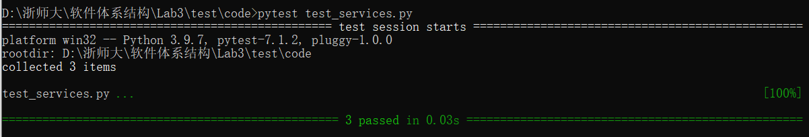

Lab3:  
=======================================  
Introduction  
--------------------------------------  

成员信息：

[刘奕秀]-201931990209-1978933929@qq.com(TECHLEAD)

[李敏]-201931990403-2609891867@qq.com

[吴佩媛]-201931990410-29723741292@qq.com

- 了解存储库的模式。  

- 了解服务层模式。  

- 理解为什么将业务逻辑与数据存储技术分离起来很重要  

Material and Methods  
-----------------------------------  
**2.1 工具**  

1. Repository Pattern：

在域和数据映射层之间添加仓储层，以将域对象与数据库访问代码的细节隔离开来，并最小化查询代码的分散和重复。

**2.2 方法**

存储库模式：

https://www.cosmicpython.com/book/chapter_02_repository.html

Result  
-----------------------------------------  
**3.1 repository.py**  

**代码**  

.. code::  

 import abc
 import model
 import os,pickle

 class AbstractRepository(abc.ABC):
    @abc.abstractmethod
    def add(self, batch: model.Batch):
        raise NotImplementedError

    @abc.abstractmethod
    def get(self, reference) -> model.Batch:
        raise NotImplementedError

 class SqlAlchemyRepository(AbstractRepository):  
    def __init__(self, session):
        self.session = session

    def add(self, batch):
        self.session.add(batch)

    def get(self, reference):
        return self.session.query(model.Batch).filter_by(reference=reference).one()

    def list(self):
        return self.session.query(model.Batch).all()

 class PickleRepository(AbstractRepository):
    ''' Complete the definition of this class. '''
    def __init__(self, path = None):
        self.path = path

    def add(self, batch):
        f = open(self.path, 'wb')   #以二进制格式写入文件
        pickle.dump(batch, f)       #将 Python 中的对象序列化成二进制对象，并写入文件
        f.close()

    def get(self, reference):
        result = []
        batches = list(self.path)   #获取pickle文件中所有Batch对象
        if batches:
            for batch in batches:
                if batch.reference == reference:  #查找所有符合对象
                    result.append(batch)     
        return result

    def list(self):
        if os.path.getsize(self.path) > 0:  #判断文件是否为空
            f = open(self.path, 'rb')       #以二进制格式读取文件
            batches = []
            while 1:        #读取未知数量的 pickle 对象，反复 load 文件对象，直到抛出异常为止
                try:
                    batches.append(pickle.load(f))  #读取指定的序列化数据文件，并返回对象
                except EOFError:
                    break
            f.close()
            return batches

**3.2 运行结果**

**3.3 视频结果**

【测试过程.mp4】  https://cloud.zjnu.edu.cn/share/5eaf2b5a0d73b72ca063fd3583

Discussion
-----------------------------------
- 教科书test services.py和我的test services.py有什么区别？

 区别：读取数据的来源不同

- 在我们选择为存储库模式使用另一个实现后，服务层是否受到了影响？我们可以说服务层不知道持久性吗？

 选择为存储库模式使用另一个实现后，服务层不会收到影响，我们可以说服务层不知道持久性
  
- 将业务逻辑与基础设施问题分离有什么好处？

 好处：降低了业务逻辑对基础设施的依赖，便于对基础设施的管理
 
- 在哪里定义了业务逻辑，以及在哪里定义了基础结构？告诉我Python文件名.

 在model.py定义了业务逻辑， repository.py中定义了基础结构

Reference
-------------------------------------

https://blog.csdn.net/weixin_42072280/article/details/105989561

http://c.biancheng.net/view/5736.html

https://blog.csdn.net/weixin_34362875/article/details/89770393

